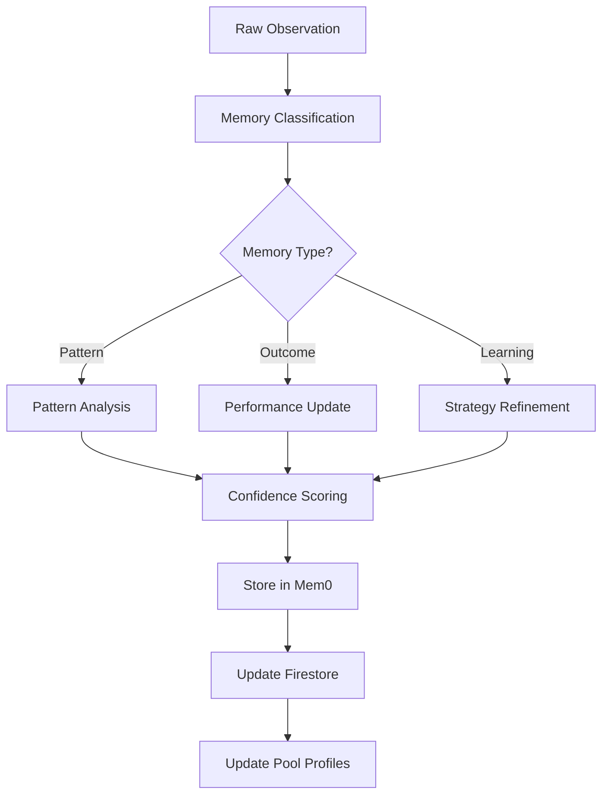
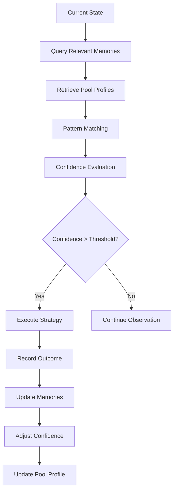

# Athena AI Database Architecture

## Overview

Athena AI employs a sophisticated dual-database architecture combining **Mem0** for vector-based semantic memory storage and **Google Cloud Firestore** for structured data persistence. This architecture enables intelligent pattern recognition, learning from experience, and adaptive decision-making in DeFi operations.

## Architecture Components

### 1. Memory System (Mem0)

Mem0 serves as Athena's episodic and semantic memory, providing vector-based storage and retrieval capabilities for learning and pattern recognition.

#### Memory Types
```python
class MemoryType(str, Enum):
    OBSERVATION = "observation"  # Raw market observations
    PATTERN = "pattern"         # Discovered patterns and correlations
    STRATEGY = "strategy"       # Strategy execution plans
    OUTCOME = "outcome"         # Results of actions taken
    LEARNING = "learning"       # Extracted insights and lessons
    ERROR = "error"            # Error scenarios for learning
```

#### Memory Categories

The system organizes memories into specialized categories for efficient retrieval:

**Core Categories:**
- `market_pattern` - Market behavior patterns
- `gas_optimization` - Gas price patterns and optimal windows
- `strategy_performance` - Historical strategy outcomes
- `pool_behavior` - Individual pool characteristics
- `pool_analysis` - General pool metrics and data
- `user_preference` - User-defined preferences
- `error_learning` - Error tracking and recovery
- `profit_source` - Sources of profitable opportunities

**Rebalancing Pattern Categories:**
- `apr_degradation_patterns` - How APRs decay over time
- `gas_optimization_windows` - Best times for transactions
- `compound_roi_patterns` - Optimal compounding frequency
- `pool_lifecycle_patterns` - New pool behavior, TVL impact
- `rebalance_success_metrics` - Learn from past rebalances
- `tvl_impact_patterns` - How TVL affects APR
- `rebalance_timing` - Optimal times to rebalance
- `compound_threshold` - Minimum rewards to compound

**Additional Categories:**
- `gauge_emissions` - AERO emission rates and patterns
- `volume_tracking` - Real swap volumes from events
- `arbitrage_opportunity` - Detected price imbalances
- `new_pool` - New pool discoveries
- `apr_anomaly` - Unusual APR changes
- `fee_collection` - Fee event tracking
- `cross_pool_correlation` - Correlations between different pools

#### Memory Storage Structure

Each memory entry contains:
```python
class MemoryEntry(BaseModel):
    id: Optional[str]              # Unique memory identifier
    type: MemoryType              # Type of memory
    category: str                 # Category for organization
    content: str                  # Memory content (text or JSON)
    metadata: Dict[str, Any]      # Additional structured data
    confidence: float             # Confidence score (0-1)
    timestamp: datetime           # When memory was created
    references: List[str]         # Related memory IDs
```

#### Memory Operations

**Storage:**
- Memories are stored with semantic embedding for similarity search
- Metadata is cleaned and serialized for JSON compatibility
- Large metadata is automatically truncated to fit Mem0's 2000 character limit
- Priority fields preserved: `pool`, `apr`, `tvl`, `volume`, `pattern_type`
- Custom JSON encoder handles Decimal and datetime objects

**Retrieval:**
- Vector similarity search based on query
- Filtering by category, type, and confidence threshold
- Time-based filtering for recent memories
- Pool-specific memory queries with metadata filtering

**Special Memory Functions:**
```python
# Pool-specific memory recall
async def recall_pool_memories(pool_pair: str, memory_type: Optional[MemoryType], 
                             time_window_hours: Optional[int], limit: int)

# Pattern discovery across observations
async def find_patterns(observations: List[str], min_occurrences: int)

# Cross-pool correlation tracking
async def remember_pool_correlation(pool_a: str, pool_b: str, 
                                  correlation_type: str, correlation_strength: float)

# Timeline construction for pools
async def get_pool_timeline(pool_pair: str, hours: int)
```

### 2. Firestore Collections

Firestore provides structured data storage for operational data, metrics, and discovered patterns.

#### Collection Schemas

##### `agent_state`
Current operational state of the agent:
```json
{
  "current": {
    "cycle_number": 1234,
    "positions": ["position_id_1", "position_id_2"],
    "total_value_usd": 10000.50,
    "last_action": "rebalance",
    "emotional_state": "confident",
    "observation_mode": false,
    "last_update": "2024-01-15T10:30:00Z"
  }
}
```

##### `cycles`
Historical record of each reasoning cycle:
```json
{
  "cycle_1234": {
    "cycle_number": 1234,
    "timestamp": "2024-01-15T10:30:00Z",
    "observations": [...],
    "decisions": [...],
    "actions_taken": [...],
    "gas_used": 0.025,
    "profit_loss": 12.50
  }
}
```

##### `positions`
Active liquidity positions:
```json
{
  "position_id": {
    "pool_address": "0x...",
    "pool_pair": "WETH/USDC",
    "lp_tokens": "1000000000000000000",
    "value_usd": 5000.00,
    "apr": 45.5,
    "created_at": "2024-01-10T08:00:00Z",
    "status": "active",
    "last_compound": "2024-01-15T08:00:00Z"
  }
}
```

##### `performance`
Aggregated performance metrics:
```json
{
  "summary": {
    "total_profit": 1250.50,
    "total_gas_spent": 125.30,
    "win_rate": 0.85,
    "average_apr": 42.5,
    "total_cycles": 5000,
    "successful_rebalances": 45,
    "failed_rebalances": 3,
    "last_update": "2024-01-15T10:30:00Z"
  }
}
```

##### `observed_patterns`
Discovered market patterns:
```json
{
  "pattern_id": {
    "pattern_type": "apr_degradation",
    "description": "New pools lose 30-50% APR in first week",
    "confidence": 0.85,
    "occurrences": 25,
    "discovered_at": "2024-01-05T12:00:00Z",
    "metadata": {
      "avg_apr_drop": 0.42,
      "time_window_days": 7,
      "affected_pools": ["pool1", "pool2"]
    }
  }
}
```

##### `pattern_confidence`
Confidence scores for patterns based on outcomes:
```json
{
  "pattern_id": {
    "pattern_id": "pattern_123",
    "confidence": 0.87,
    "occurrences": 50,
    "successes": 44,
    "last_update": "2024-01-15T10:00:00Z"
  }
}
```

##### `observation_metrics`
Metrics from observation periods:
```json
{
  "current": {
    "observation_days": 3,
    "patterns_discovered": 15,
    "pools_analyzed": 250,
    "high_confidence_patterns": 8,
    "avg_pattern_confidence": 0.75,
    "last_update": "2024-01-15T10:30:00Z"
  }
}
```

##### `pool_profiles`
Comprehensive profiles for individual pools:
```json
{
  "0x...pool_address": {
    "pool_address": "0x...",
    "pair": "WETH/USDC",
    "stable": false,
    "created_at": "2024-01-01T00:00:00Z",
    "apr_range": [15.5, 125.8],
    "tvl_range": [100000, 5000000],
    "volume_range": [50000, 2000000],
    "hourly_patterns": {
      "14": {
        "avg_apr": 45.5,
        "avg_volume": 500000,
        "count": 30
      }
    },
    "daily_patterns": {
      "Monday": {
        "avg_apr": 42.0,
        "avg_volume": 450000,
        "count": 10
      }
    },
    "typical_volume_to_tvl": 0.15,
    "volatility_score": 0.25,
    "correlation_with_gas": -0.35,
    "observations_count": 500,
    "confidence_score": 0.92,
    "last_updated": "2024-01-15T10:00:00Z"
  }
}
```

##### `pool_metrics`
Time-series metrics for pools:
```json
{
  "metric_id": {
    "pool_address": "0x...",
    "timestamp": "2024-01-15T10:00:00Z",
    "apr": 45.5,
    "tvl": 2500000,
    "volume_24h": 375000,
    "fee_apr": 25.5,
    "incentive_apr": 20.0,
    "reserves": {
      "WETH": 1000.5,
      "USDC": 2500000
    },
    "ratio": 0.0004,
    "gas_price": 25.5
  }
}
```

##### `pattern_correlations`
Cross-pool correlations:
```json
{
  "correlation_id": {
    "pool_a": "WETH/USDC",
    "pool_b": "WETH/USDT",
    "correlation_type": "volume",
    "correlation_strength": 0.85,
    "discovered_at": "2024-01-10T15:00:00Z",
    "metadata": {
      "sample_size": 100,
      "time_window_hours": 168
    }
  }
}
```

## Pool Profile System

The pool profile system (`src/agent/pool_profiles.py`) tracks individual pool behaviors and patterns over time.

### PoolMetrics Data Structure
```python
@dataclass
class PoolMetrics:
    timestamp: datetime
    apr: Decimal
    tvl: Decimal
    volume_24h: Decimal
    fee_apr: Decimal
    incentive_apr: Decimal
    reserves: Dict[str, Decimal]
    ratio: Decimal
    gas_price: Optional[Decimal] = None
```

### PoolProfile Features

**Historical Tracking:**
- APR ranges (min/max)
- TVL ranges (min/max) 
- Volume ranges (min/max)
- Recent metrics buffer (last 100 observations)

**Pattern Recognition:**
- Hourly patterns (average metrics by hour)
- Daily patterns (average metrics by day)
- Time-based prediction capabilities

**Behavioral Analysis:**
- Typical volume-to-TVL ratio
- Volatility score (APR standard deviation)
- Gas price correlation coefficient
- Anomaly detection with severity scoring

**Confidence Scoring:**
```python
confidence = (
    observation_weight * 0.4 +
    recency_weight * 0.3 +
    pattern_weight * 0.3
)
```

### Pool Profile Manager

The `PoolProfileManager` class provides:
- Profile creation and updates
- Firestore persistence
- High-confidence pool filtering
- Gas-correlated pool identification
- Opportunity prediction based on patterns

## Smart Rebalancer System

The rebalancer (`src/agent/rebalancer.py`) uses memories and patterns for intelligent position management.

### Key Components

**Memory-Driven Decision Making:**
1. APR prediction based on historical patterns
2. Gas optimization using learned windows
3. Compound timing optimization
4. Risk-adjusted rebalancing

**Pattern Categories Used:**
- `apr_degradation_patterns` - Predict APR decay
- `gas_optimization_windows` - Find optimal gas times
- `tvl_impact_patterns` - Assess TVL effects
- `rebalance_success_metrics` - Learn from outcomes

**Decision Flow:**
```python
1. Analyze current positions
2. Query relevant memories for each pool
3. Predict future APR using patterns
4. Determine if rebalancing needed
5. Find better opportunities
6. Calculate profitability including gas
7. Execute if profitable with high confidence
```

**Learning Process:**
- Records all rebalancing outcomes
- Analyzes success patterns
- Identifies optimal timing
- Refines decision thresholds

## Data Flow and Lifecycle

### 1. Memory Formation Process



### 2. Decision Making Flow



### 3. Pool Profile Update Flow

1. **Metric Collection**: Every cycle collects current pool metrics
2. **Profile Update**: Updates ranges, patterns, and behavioral scores
3. **Pattern Detection**: Identifies hourly and daily patterns
4. **Anomaly Detection**: Flags unusual behavior for investigation
5. **Prediction**: Uses patterns to predict future metrics
6. **Persistence**: Saves to Firestore for durability

## Query Patterns and Optimization

### 1. Common Query Patterns

**Pattern Discovery:**
```python
# Find APR degradation patterns for new pools
memories = await memory.recall(
    "new pool APR degradation patterns",
    memory_type=MemoryType.PATTERN,
    category="apr_degradation_patterns",
    min_confidence=0.7
)
```

**Pool-Specific Analysis:**
```python
# Get all memories for a specific pool
pool_memories = await memory.recall_pool_memories(
    pool_pair="WETH/USDC",
    time_window_hours=24,
    limit=50
)
```

**Cross-Pool Correlations:**
```python
# Find correlations between pools
correlations = await memory.get_cross_pool_correlations()
```

**Rebalancing Insights:**
```python
# Get gas optimization patterns
gas_patterns = await memory.recall(
    "gas price patterns optimal times",
    memory_type=MemoryType.PATTERN,
    category="gas_optimization_windows",
    limit=20
)
```

### 2. Optimization Strategies

**Memory Indexing:**
- Memories indexed by type, category, and timestamp
- Pool-specific memories indexed by pool address/pair
- Confidence scores enable fast filtering
- Metadata fields indexed for complex queries

**Batch Operations:**
- Bulk memory retrieval for related patterns
- Parallel Firestore queries for efficiency
- Cached pool profiles for frequent access
- Async operations for non-blocking execution

**Data Retention:**
- Recent memories (< 24h) kept in fast access
- Historical patterns aggregated and summarized
- Low-confidence memories periodically pruned
- Pool metrics aggregated hourly/daily

## Pattern Learning System

### 1. Pattern Discovery

The system discovers patterns through:

**Frequency Analysis:**
- Repeated observations trigger pattern creation
- Minimum occurrence threshold (default: 3)
- Confidence increases with repetitions
- Pattern merging for similar observations

**Correlation Analysis:**
- Cross-pool behavior correlations
- Time-based pattern correlations
- Gas price impact correlations
- Volume-APR relationships

**Outcome Tracking:**
- Success/failure rates for strategies
- Profit/loss patterns
- Gas optimization outcomes
- Rebalancing effectiveness

### 2. Confidence Scoring

Pool Profile Confidence:
```python
confidence = (
    observation_score * 0.4 +    # Based on observation count
    recency_score * 0.3 +        # How recent the data is
    pattern_score * 0.3          # Pattern consistency
)
```

Memory Confidence:
- Initial confidence based on observation frequency
- Updated based on prediction accuracy
- Decays over time without reinforcement
- Boosted by successful outcomes

### 3. Pattern Evolution

Patterns evolve through:
- **Reinforcement**: Successful outcomes increase confidence
- **Decay**: Unused patterns gradually lose confidence
- **Refinement**: Patterns merge and split based on new data
- **Pruning**: Low-confidence patterns removed

## Data Persistence and Recovery

### 1. Backup Strategy

**Mem0 Backups:**
- Export functionality for all memories
- JSON format for portability
- Includes metadata and relationships
- Periodic snapshots to Firestore

**Firestore Backups:**
- Automated GCP backups
- Point-in-time recovery
- Cross-region replication
- Daily export to Cloud Storage

### 2. Data Consistency

**Transaction Handling:**
- Atomic updates for related data
- Rollback on failures
- Event sourcing for audit trail
- Idempotent operations

**Synchronization:**
- Mem0 and Firestore kept in sync
- Async updates with retry logic
- Conflict resolution strategies
- Version tracking for updates

## Performance Considerations

### 1. Query Performance

**Mem0 Optimization:**
- Vector indices for fast similarity search
- Metadata filtering before vector search
- Result caching for frequent queries
- Batch operations for multiple recalls

**Firestore Optimization:**
- Composite indices for complex queries
- Query result pagination
- Denormalized data for read performance
- Collection group queries for cross-collection searches

### 2. Storage Efficiency

**Memory Management:**
- Automatic metadata truncation
- Compression for large memories
- Periodic cleanup of old data
- Memory summarization for old entries

**Cost Optimization:**
- Tiered storage for historical data
- Aggregation of time-series data
- Efficient serialization formats
- Read/write batching

## Real-Time Monitoring

### Key Metrics Tracked
- Memory formation rate
- Pattern discovery rate
- Confidence score trends
- Pool profile coverage
- Rebalancing success rate

### Health Indicators
- Memory recall latency
- Firestore query performance
- Pattern prediction accuracy
- Storage growth rate
- API quota usage

## Future Enhancements

### 1. Advanced Analytics
- Real-time pattern detection using streaming
- Predictive modeling with ML integration
- Advanced correlation analysis across chains
- Sentiment analysis from external sources

### 2. Scalability Improvements
- Distributed memory system with sharding
- Federated learning across agents
- Edge caching for global deployment
- GraphDB for complex relationships

### 3. Enhanced Learning
- Deep learning for pattern recognition
- Reinforcement learning for strategy optimization
- Multi-agent knowledge sharing protocols
- Transfer learning from successful strategies

### 4. Data Integration
- Cross-chain pattern recognition
- External data source integration
- Social sentiment correlation
- Macro market indicators