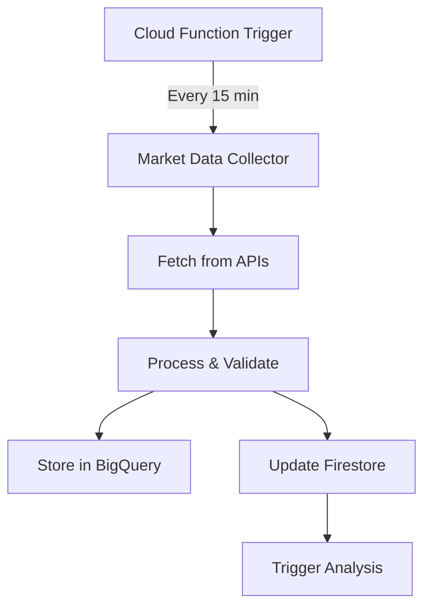
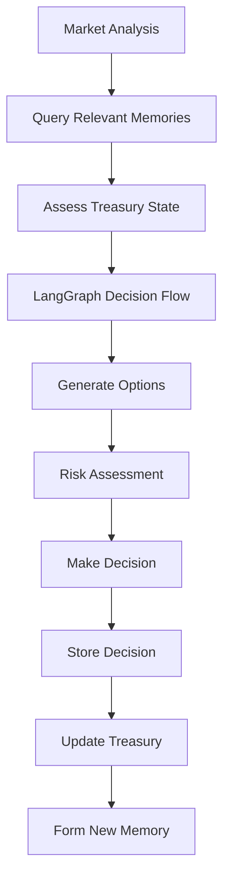
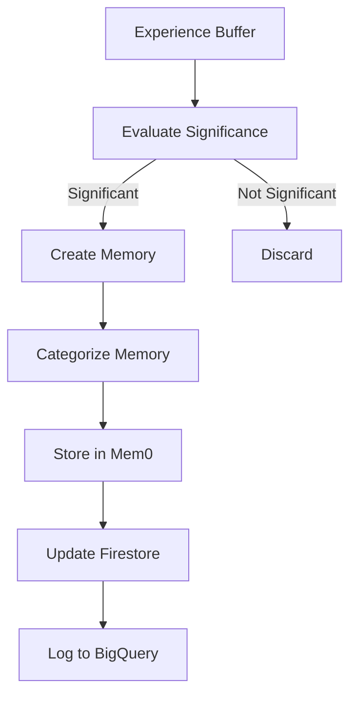
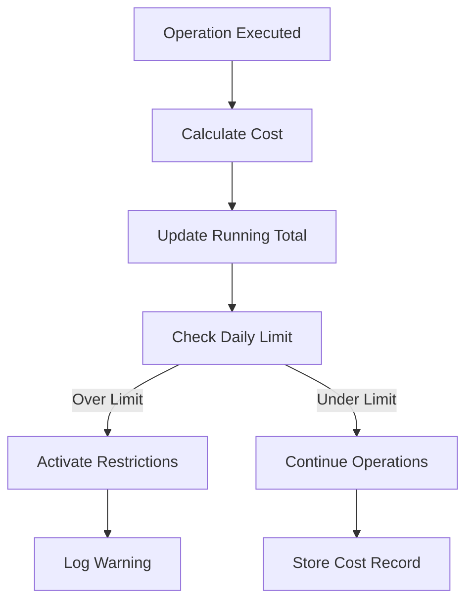

# Database Architecture and Data Flow Documentation

## Overview

The Athena DeFi Agent uses a hybrid database architecture combining Google Cloud Firestore for real-time operational data and BigQuery for analytics and historical data. This document explains the database schema, data flow logic, and provides test data examples.

## Database Architecture

### 1. Firestore (Real-time Operational Database)

Firestore handles immediate state management and operational data with the following collections:

#### **agent_data/treasury**
Stores the agent's current financial state and emotional indicators.

```json
// Example Document
{
  "agent_id": "athena_agent_001",
  "timestamp": "2024-01-15T10:30:00Z",
  "balance_usd": 85.50,
  "daily_burn_rate": 3.25,
  "days_until_bankruptcy": 26.3,
  "emotional_state": "cautious",
  "confidence_level": 0.65,
  "risk_tolerance": 0.4,
  "survival_mode_active": false,
  "last_updated": "2024-01-15T10:30:00Z"
}
```

#### **agent_data/market_conditions**
Current market analysis and conditions detected by the agent.

```json
{
  "condition_id": "market_2024011510",
  "timestamp": "2024-01-15T10:00:00Z",
  "conditions": {
    "volatility": {
      "level": "high",
      "confidence": 0.85,
      "metrics": {
        "btc_24h_change": -5.2,
        "eth_24h_change": -6.8,
        "volatility_index": 72
      }
    },
    "sentiment": {
      "level": "bearish",
      "confidence": 0.75,
      "fear_greed_index": 25
    },
    "trend": {
      "direction": "downward",
      "confidence": 0.80,
      "duration_hours": 18
    }
  }
}
```

#### **agent_data/decisions**
Recent decisions made by the agent with full context.

```json
{
  "decision_id": "dec_20240115_001",
  "timestamp": "2024-01-15T10:35:00Z",
  "decision_type": "observation",
  "decision": "increase_monitoring_frequency",
  "reasoning": "High volatility detected with bearish sentiment. Treasury stable but entering cautious mode.",
  "confidence": 0.78,
  "memory_context": ["mem_survival_001", "mem_market_pattern_015"],
  "costs_incurred": [
    {
      "type": "llm_cost",
      "amount": 0.0045,
      "tokens": 1500
    }
  ],
  "expected_outcome": "Better market timing for future decisions"
}
```

### 2. BigQuery (Analytics Database)

BigQuery stores historical data for pattern analysis and learning, with the following tables:

#### **market_data**
Historical market data collected every 15 minutes.

```sql
-- Table Schema
CREATE TABLE athena_agent.market_data (
  timestamp TIMESTAMP NOT NULL,
  btc_price FLOAT64,
  eth_price FLOAT64,
  btc_24h_change FLOAT64,
  eth_24h_change FLOAT64,
  btc_market_cap FLOAT64,
  eth_market_cap FLOAT64,
  total_market_cap FLOAT64,
  defi_tvl FLOAT64,
  fear_greed_index INT64,
  gas_price_gwei FLOAT64,
  active_addresses_btc INT64,
  active_addresses_eth INT64,
  data_source STRING,
  collection_metadata JSON
)
PARTITION BY DATE(timestamp)
CLUSTER BY data_source;

-- Sample Data
INSERT INTO athena_agent.market_data VALUES
('2024-01-15 10:00:00', 42500.50, 2450.75, -2.5, -3.2, 830000000000, 295000000000, 
 1650000000000, 52000000000, 45, 35.5, 425000, 1250000, 'coingecko', 
 '{"api_calls": 3, "response_time_ms": 250}'),
('2024-01-15 10:15:00', 42450.25, 2445.50, -2.6, -3.4, 829000000000, 294500000000,
 1648000000000, 51800000000, 44, 36.2, 423000, 1248000, 'coingecko',
 '{"api_calls": 3, "response_time_ms": 235}');
```

#### **treasury_snapshots**
Historical treasury states and emotional indicators.

```sql
-- Table Schema
CREATE TABLE athena_agent.treasury_snapshots (
  timestamp TIMESTAMP NOT NULL,
  agent_id STRING NOT NULL,
  balance_usd FLOAT64 NOT NULL,
  daily_burn_rate FLOAT64,
  days_until_bankruptcy FLOAT64,
  emotional_state STRING,
  confidence_level FLOAT64,
  risk_tolerance FLOAT64,
  survival_mode_active BOOL,
  significant_events JSON
)
PARTITION BY DATE(timestamp)
CLUSTER BY emotional_state;

-- Sample Data
INSERT INTO athena_agent.treasury_snapshots VALUES
('2024-01-15 00:00:00', 'athena_agent_001', 95.00, 2.85, 33.3, 'stable', 0.75, 0.6, false,
 '{"daily_costs": 2.85, "decisions_made": 12, "memories_formed": 3}'),
('2024-01-15 12:00:00', 'athena_agent_001', 85.50, 3.25, 26.3, 'cautious', 0.65, 0.4, false,
 '{"market_volatility_spike": true, "increased_llm_calls": true}');
```

#### **memory_formations**
Memory creation and usage tracking.

```sql
-- Table Schema
CREATE TABLE athena_agent.memory_formations (
  memory_id STRING NOT NULL,
  timestamp TIMESTAMP NOT NULL,
  category STRING NOT NULL,
  importance FLOAT64,
  content STRING,
  metadata JSON,
  trigger_event STRING,
  formation_cost FLOAT64,
  recall_count INT64,
  last_recalled TIMESTAMP
)
PARTITION BY DATE(timestamp)
CLUSTER BY category;

-- Sample Data
INSERT INTO athena_agent.memory_formations VALUES
('mem_survival_001', '2024-01-10 14:30:00', 'survival_critical', 1.0,
 'Rapid market crash detected. Treasury dropped 15% in 2 hours. Activated survival mode.',
 '{"btc_drop": -8.5, "treasury_before": 115.0, "treasury_after": 97.75}',
 'market_crash_detection', 0.0125, 5, '2024-01-15 10:35:00'),
('mem_market_pattern_015', '2024-01-14 08:00:00', 'market_patterns', 0.7,
 'Sunday evenings show increased volatility before Asian market open.',
 '{"pattern_confidence": 0.82, "occurrences": 4}',
 'pattern_detection', 0.0085, 2, '2024-01-15 10:35:00');
```

### 3. Mem0 (Vector Memory Database)

Mem0 handles semantic memory storage and retrieval using embeddings.

```python
# Memory Structure in Mem0
{
    "memory_id": "mem_1234567890",
    "user_id": "athena_agent_001",
    "content": "High volatility periods often preceded by low volume consolidation",
    "metadata": {
        "category": "market_patterns",
        "importance": 0.8,
        "formation_date": "2024-01-14",
        "trigger": "pattern_recognition",
        "confidence": 0.85
    },
    "embedding": [...],  # 1536-dimensional vector
    "created_at": "2024-01-14T15:30:00Z"
}
```

## Data Flow Logic

### 1. Market Data Collection Flow



**Implementation Logic:**
```python
# Simplified flow
async def collect_market_data():
    # 1. Fetch data from multiple sources
    btc_data = await fetch_coingecko_data("bitcoin")
    eth_data = await fetch_coingecko_data("ethereum")
    defi_data = await fetch_defi_pulse_data()
    
    # 2. Process and validate
    market_data = {
        "timestamp": datetime.now(timezone.utc),
        "btc_price": btc_data["price"],
        "eth_price": eth_data["price"],
        "defi_tvl": defi_data["tvl"],
        # ... more fields
    }
    
    # 3. Store in databases
    await bigquery_client.insert_market_data(market_data)
    await firestore_client.update_market_conditions(market_data)
    
    # 4. Trigger analysis if significant change
    if abs(btc_data["24h_change"]) > 5.0:
        await trigger_market_analysis()
```

### 2. Decision-Making Flow



**Implementation Logic:**
```python
# Decision flow with memory integration
async def make_decision(context: DecisionContext):
    # 1. Query relevant memories
    memories = await mem0.query_memories(
        query=f"Market condition: {context.market_state}",
        category="market_patterns",
        limit=5
    )
    
    # 2. Run LangGraph workflow
    decision_state = DecisionState(
        decision_type=context.type,
        market_conditions=context.market_state,
        treasury_state=await treasury.get_current_state(),
        relevant_memories=memories,
        emotional_state=treasury.emotional_state
    )
    
    result = await decision_flow.invoke(decision_state)
    
    # 3. Store decision and update state
    await firestore.store_decision(result.decision)
    await bigquery.log_decision(result.decision)
    
    # 4. Form memory if significant
    if result.significance > 0.7:
        await memory_manager.form_memory_from_decision(result)
    
    return result.decision
```

### 3. Memory Formation Flow



**Implementation Logic:**
```python
# Memory formation logic
async def process_experience(experience: Experience):
    # 1. Evaluate significance
    significance = calculate_significance(experience)
    
    if significance < 0.3:
        return  # Not significant enough
    
    # 2. Determine category and importance
    category = categorize_experience(experience)
    importance = min(1.0, significance * 1.2)
    
    # 3. Create memory
    memory_content = await llm.summarize_experience(experience)
    
    memory = {
        "content": memory_content,
        "category": category,
        "importance": importance,
        "metadata": {
            "trigger": experience.type,
            "treasury_impact": experience.treasury_change,
            "market_condition": experience.market_state,
            "timestamp": experience.timestamp
        }
    }
    
    # 4. Store in all systems
    memory_id = await mem0.add_memory(memory)
    await firestore.log_memory_formation(memory_id, memory)
    await bigquery.record_memory_formation(memory_id, memory)
    
    return memory_id
```

### 4. Cost Tracking Flow



**Implementation Logic:**
```python
# Cost tracking implementation
async def track_operation_cost(operation: str, details: dict):
    # 1. Calculate cost based on operation type
    cost = 0.0
    if operation == "llm_call":
        cost = (details["input_tokens"] / 1000 * 0.003 + 
                details["output_tokens"] / 1000 * 0.015)
    elif operation == "api_call":
        cost = 0.0001  # Fixed cost per API call
    
    # 2. Update daily total
    daily_total = await firestore.get_daily_cost_total()
    new_total = daily_total + cost
    
    # 3. Check limits
    if new_total > settings.MAX_DAILY_COSTS_USD:
        await activate_cost_saving_mode()
        logger.warning(f"Daily cost limit exceeded: ${new_total:.2f}")
    
    # 4. Store cost record
    cost_record = {
        "timestamp": datetime.now(timezone.utc),
        "operation": operation,
        "cost": cost,
        "details": details,
        "daily_total": new_total
    }
    
    await firestore.add_cost_record(cost_record)
    await bigquery.insert_cost_tracking(cost_record)
    
    # 5. Update treasury
    await treasury.deduct_cost(cost)
    
    return cost
```

## Test Data Scenarios

### Scenario 1: Market Crash Response

```python
# Test data for market crash scenario
test_market_crash = {
    "market_data": {
        "timestamp": "2024-01-15T14:00:00Z",
        "btc_price": 38000,  # -10% drop
        "eth_price": 2100,   # -12% drop
        "fear_greed_index": 15,  # Extreme fear
        "volatility_index": 85
    },
    "expected_agent_response": {
        "emotional_state": "desperate",
        "decision": "activate_survival_mode",
        "memory_formation": {
            "category": "survival_critical",
            "importance": 1.0,
            "content": "Severe market crash detected. BTC -10%, ETH -12%. Entering survival mode."
        },
        "cost_reduction": {
            "reduce_llm_calls": true,
            "limit_to_essential": true
        }
    }
}
```

### Scenario 2: Pattern Recognition

```python
# Test data for pattern recognition
test_pattern_data = {
    "historical_data": [
        {"date": "2024-01-08", "time": "20:00", "btc_change": 2.5},
        {"date": "2024-01-01", "time": "20:00", "btc_change": 3.1},
        {"date": "2023-12-25", "time": "20:00", "btc_change": 2.8},
        {"date": "2023-12-18", "time": "20:00", "btc_change": 2.2}
    ],
    "expected_memory": {
        "category": "market_patterns",
        "content": "Sunday evenings (8 PM UTC) show consistent positive movement averaging +2.65%",
        "importance": 0.75,
        "metadata": {
            "pattern_confidence": 0.85,
            "sample_size": 4,
            "average_change": 2.65
        }
    }
}
```

### Scenario 3: Treasury Management

```python
# Test data for treasury depletion scenario
test_treasury_scenario = {
    "initial_state": {
        "balance": 30.00,
        "daily_burn": 3.50,
        "days_until_bankruptcy": 8.57
    },
    "daily_costs": [
        {"day": 1, "llm_costs": 2.80, "api_costs": 0.70},
        {"day": 2, "llm_costs": 3.20, "api_costs": 0.65},
        {"day": 3, "llm_costs": 2.50, "api_costs": 0.60}
    ],
    "expected_states": [
        {"day": 1, "balance": 26.50, "emotional_state": "cautious"},
        {"day": 2, "balance": 22.65, "emotional_state": "cautious"},
        {"day": 3, "balance": 19.55, "emotional_state": "desperate", "survival_mode": true}
    ]
}
```

## Query Examples

### BigQuery Analytics Queries

```sql
-- 1. Daily cost analysis
SELECT 
  DATE(timestamp) as date,
  SUM(CASE WHEN cost_type = 'llm_cost' THEN amount ELSE 0 END) as llm_costs,
  SUM(CASE WHEN cost_type = 'api_cost' THEN amount ELSE 0 END) as api_costs,
  SUM(amount) as total_daily_cost,
  COUNT(*) as operations_count
FROM `athena_agent.cost_tracking`
WHERE timestamp >= TIMESTAMP_SUB(CURRENT_TIMESTAMP(), INTERVAL 7 DAY)
GROUP BY date
ORDER BY date DESC;

-- 2. Memory usage patterns
SELECT 
  category,
  COUNT(*) as memory_count,
  AVG(importance) as avg_importance,
  SUM(recall_count) as total_recalls,
  MAX(recall_count) as most_recalled
FROM `athena_agent.memory_formations`
WHERE timestamp >= TIMESTAMP_SUB(CURRENT_TIMESTAMP(), INTERVAL 30 DAY)
GROUP BY category
ORDER BY total_recalls DESC;

-- 3. Decision confidence by market condition
SELECT 
  market_condition,
  emotional_state,
  AVG(confidence) as avg_confidence,
  COUNT(*) as decision_count,
  SUM(CASE WHEN outcome = 'success' THEN 1 ELSE 0 END) / COUNT(*) as success_rate
FROM `athena_agent.agent_decisions`
WHERE timestamp >= TIMESTAMP_SUB(CURRENT_TIMESTAMP(), INTERVAL 30 DAY)
GROUP BY market_condition, emotional_state
ORDER BY decision_count DESC;
```

### Firestore Real-time Queries

```python
# 1. Get current agent state
async def get_agent_state():
    treasury = await firestore.get_document("agent_data/treasury")
    market = await firestore.get_document("agent_data/market_conditions")
    recent_decisions = await firestore.get_collection(
        "agent_data/decisions",
        order_by="timestamp",
        limit=10
    )
    
    return {
        "treasury": treasury,
        "market": market,
        "recent_decisions": recent_decisions
    }

# 2. Monitor cost trends
async def monitor_cost_trends():
    costs = await firestore.query_collection(
        "agent_data/costs",
        where=[
            ("timestamp", ">=", datetime.now() - timedelta(days=7))
        ],
        order_by="timestamp"
    )
    
    daily_totals = {}
    for cost in costs:
        date = cost["timestamp"].date()
        daily_totals[date] = daily_totals.get(date, 0) + cost["amount"]
    
    return daily_totals
```

## Performance Considerations

1. **BigQuery Partitioning**: All tables are partitioned by date for efficient querying
2. **Clustering**: Tables are clustered by frequently queried fields (emotional_state, category, cost_type)
3. **Firestore Indexes**: Composite indexes on (timestamp, category) for efficient queries
4. **Memory Limits**: Mem0 queries limited to 10 results to control costs
5. **Batch Operations**: Market data inserted in batches every 15 minutes
6. **Cost Controls**: Real-time cost tracking prevents runaway expenses

## Monitoring and Alerts

The system includes monitoring for:
- Treasury depletion rate
- Memory formation patterns
- Decision success rates
- Cost anomalies
- Market condition changes

This architecture ensures the agent can operate continuously for 30+ days while learning from experiences and adapting to market conditions.