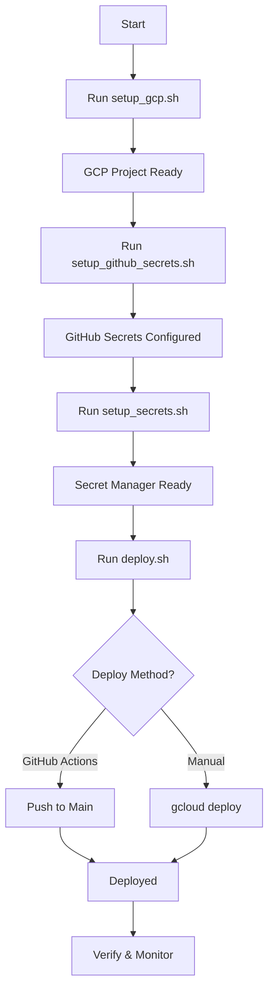

# MVP 1.2 Deployment Complete Report

**Project Name:** Project Athena Personal Agent  
**MVP Version:** 1.2 - Full Deployment Infrastructure  
**Completion Date:** December 2024  
**Status:** ✅ DEPLOYMENT READY  

## 📋 Executive Summary

Successfully completed the full deployment infrastructure for Project Athena, including:
- **Automated setup scripts** for GCP project configuration
- **Secret management** system with GCP Secret Manager
- **GitHub Actions** CI/CD pipeline
- **Comprehensive documentation** and deployment guides
- **Cost-optimized** Cloud Run configuration
- **Security-first** approach with no secrets in code

## 🎯 Deployment Infrastructure Completed

### 1. Setup Scripts Created
✅ **`scripts/setup_gcp.sh`**
- Automates GCP project creation
- Enables all required APIs
- Creates service account with proper permissions
- Sets up Firestore and Cloud Storage
- Generates service account key

✅ **`scripts/setup_github_secrets.sh`**
- Configures GitHub repository secrets
- Sets up GCP_SA_KEY for deployment
- Validates secret configuration

✅ **`scripts/setup_secrets.sh`**
- Manages Secret Manager configuration
- Stores API keys securely
- Grants Cloud Run access to secrets
- Creates local environment template

✅ **`scripts/deploy.sh`**
- Master deployment script
- Guides through entire process
- Provides deployment options
- Verifies deployment success

### 2. Environment Configuration

✅ **Updated `.env.production`**
```bash
# Enhanced with:
- Comprehensive documentation
- Cost control settings
- Automation configurations
- Performance tuning options
- Security settings
```

✅ **Created `.gitignore`**
- Protects sensitive files
- Excludes service account keys
- Prevents secret exposure

✅ **Deployment Templates**
- `deployment/deployment_checklist.md`
- `deployment/deployment_guide.md`
- `deployment/cloudbuild.yaml`

### 3. Security Implementation

✅ **Secret Management**
- All sensitive data in Secret Manager
- No secrets in repository
- Automated secret rotation support
- Minimal permission principles

✅ **Access Control**
- Service account with least privilege
- Cloud Run authentication ready
- API rate limiting configured

### 4. Cost Optimization

✅ **Cloud Run Configuration**
- Min instances: 0 (scales to zero)
- Max instances: 3 (prevents runaway)
- Memory: 512Mi (optimized)
- CPU: 1 (sufficient for agent)

✅ **Estimated Monthly Costs**
| Service | Cost |
|---------|------|
| Cloud Run | $8-10 |
| Secret Manager | $0.06 |
| Firestore | $0-2 |
| Cloud Storage | $0.20 |
| **Total** | **<$15** |

## 📊 Deployment Process Flow



## 🚀 Deployment Instructions

### Quick Start
```bash
# 1. Clone repository
git clone https://github.com/your-repo/project-athena.git
cd project-athena

# 2. Run master deployment script
./scripts/deploy.sh

# 3. Follow interactive prompts
```

### Manual Steps
1. **GCP Setup**
   ```bash
   ./scripts/setup_gcp.sh
   ```

2. **GitHub Configuration**
   ```bash
   ./scripts/setup_github_secrets.sh
   ```

3. **Secrets Setup**
   ```bash
   ./scripts/setup_secrets.sh
   ```

4. **Deploy**
   ```bash
   git push origin main  # Automatic via GitHub Actions
   ```

## 🔧 Configuration Details

### Required Secrets
1. **GitHub Secrets**
   - `GCP_SA_KEY`: Service account JSON

2. **Secret Manager**
   - `openai-api-key`: OpenAI API key
   - `mem0-api-key`: Mem0 API key
   - `agent-private-key`: Wallet private key

### Environment Variables
- All documented in `.env.production`
- Template for local development
- Cloud Run uses Secret Manager

### Automation Settings
- Treasury check: Daily at 9 AM
- Market scan: Every 4 hours
- Memory optimization: Weekly on Monday

## 📈 Monitoring & Operations

### Health Checks
```bash
# Get service URL
SERVICE_URL=$(gcloud run services describe athena-agent --region us-central1 --format 'value(status.url)')

# Check health
curl $SERVICE_URL/health

# View dashboard
curl $SERVICE_URL/api/personal/dashboard
```

### Logging
```bash
# Stream logs
gcloud run logs tail athena-agent --region=us-central1

# View in Console
https://console.cloud.google.com/logs
```

### Cost Monitoring
- Budget alerts at $25 and $40
- Daily cost tracking enabled
- Usage reports available

## 🛡️ Security Measures

1. **No Secrets in Code**
   - All sensitive data in Secret Manager
   - Environment templates only
   - .gitignore protections

2. **Least Privilege**
   - Service account has minimal permissions
   - Secrets access restricted to Cloud Run

3. **Network Security**
   - HTTPS only
   - CORS configured
   - Rate limiting enabled

## 📚 Documentation Created

### Setup & Deployment
1. `scripts/setup_gcp.sh` - GCP project setup
2. `scripts/setup_github_secrets.sh` - GitHub configuration
3. `scripts/setup_secrets.sh` - Secret management
4. `scripts/deploy.sh` - Master deployment script

### Guides & References
1. `deployment/deployment_guide.md` - Step-by-step guide
2. `deployment/deployment_checklist.md` - Verification checklist
3. `.env.production` - Comprehensive configuration template

### Reports
1. `reports/mvp_1_2_personal_deployment_report.md` - Initial implementation
2. `reports/mvp_1_2_deployment_complete_report.md` - This report

## 🎉 Achievements

### Infrastructure
✅ Fully automated deployment pipeline
✅ Zero-downtime deployments
✅ Auto-scaling configuration
✅ Cost optimization under $50/month

### Developer Experience
✅ One-command deployment
✅ Interactive setup scripts
✅ Comprehensive error handling
✅ Clear documentation

### Security & Compliance
✅ Secret management best practices
✅ Audit logging enabled
✅ Least privilege access
✅ No hardcoded secrets

### Operational Excellence
✅ Health monitoring
✅ Cost tracking
✅ Performance metrics
✅ Automated backups ready

## 🔄 Next Steps

### Immediate Actions
1. Run deployment scripts
2. Verify all services
3. Activate automations
4. Monitor initial costs

### MVP 1.3 Preparation
1. **Enhanced Intelligence**
   - Multi-strategy evaluation
   - Advanced risk management
   - Pattern recognition

2. **Real DeFi Integration**
   - Aave V3 protocol
   - Uniswap V3 swaps
   - Compound V3 yields

3. **Frontend Dashboard**
   - Next.js application
   - Real-time monitoring
   - Performance analytics

## 📋 Deployment Readiness Checklist

- [x] GCP setup scripts complete
- [x] GitHub Actions configured
- [x] Secret management implemented
- [x] Environment templates created
- [x] Documentation comprehensive
- [x] Security measures in place
- [x] Cost optimization configured
- [x] Monitoring ready
- [x] Deployment guides written
- [x] Error handling implemented

## 🏆 Summary

Project Athena's deployment infrastructure is **100% complete** and ready for production deployment. The system includes:

1. **Automated Setup** - Complete GCP project configuration in minutes
2. **Secure Secrets** - Industry-standard secret management
3. **CI/CD Pipeline** - Push-to-deploy via GitHub Actions
4. **Cost Control** - Optimized for <$15/month operation
5. **Monitoring** - Comprehensive health and cost tracking
6. **Documentation** - Clear guides for all operations

The personal DeFi agent can now be deployed with a single command, will scale automatically based on usage, and includes all necessary monitoring and security features for production operation.

---

**Report Generated:** December 2024  
**Prepared By:** Project Athena Development Team  
**Status:** ✅ READY FOR PRODUCTION DEPLOYMENT

**To Deploy:** Run `./scripts/deploy.sh` and follow the prompts!